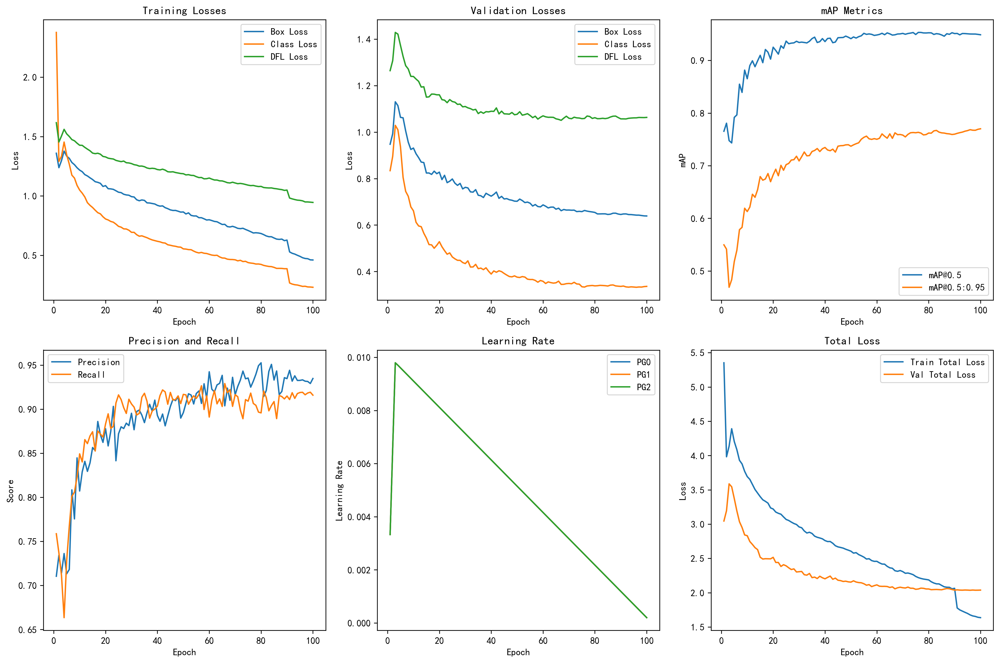
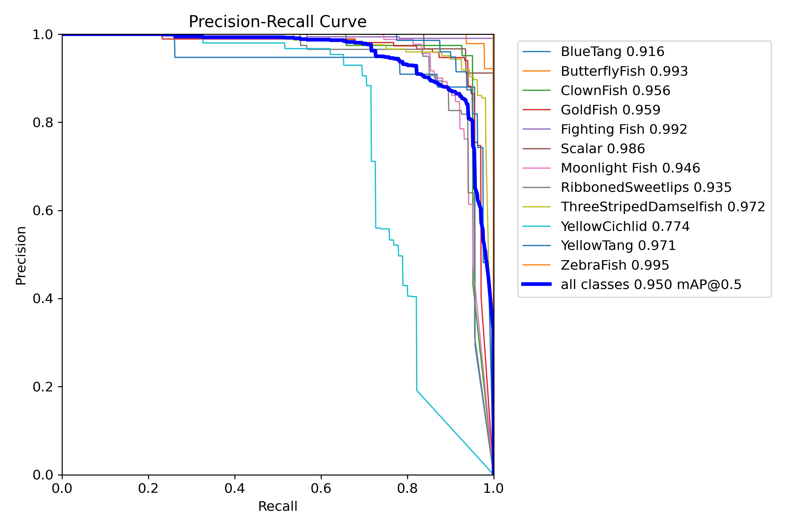
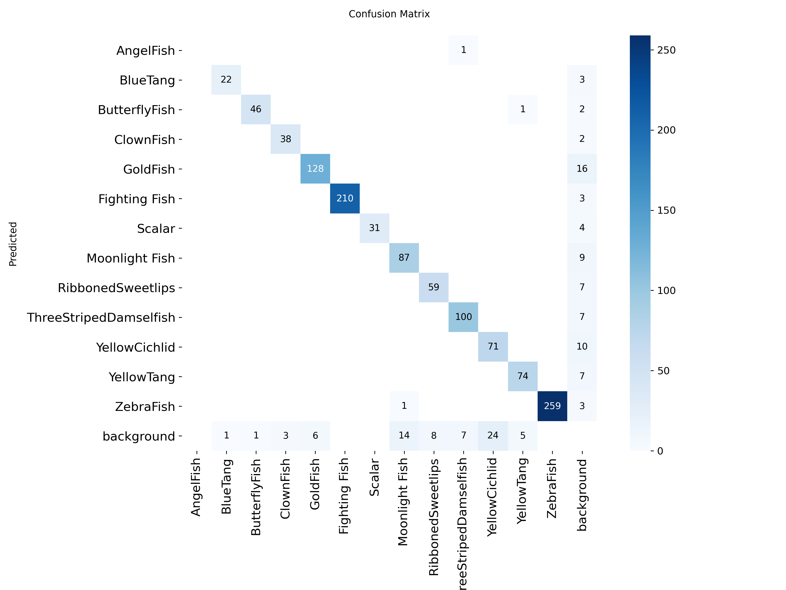

# 鱼类识别（yolov8m模型）

## 模型训练参数

| 参数 | 值                                  |
|------|------------------------------------|
| 模型架构 | YOLOv8m                            |
| 训练轮数 (epochs) | 100                                |
| 图像尺寸 (imgsz) | 640                                |
| 批次大小 (batch) | 16                                 |
| 优化器 | auto                               |
| 初始学习率 (lr0) | 0.01                               |
| 最终学习率 (lrf) | 0.01                               |
| 动量 (momentum) | 0.937                              |
| 权重衰减 (weight_decay) | 0.0005                             |
| warmup_epochs | 3.0                                |
| 数据增强 | mosaic=1.0, flipud=0.0, fliplr=0.5 |

## 模型性能指标

在验证集上的最终性能指标：
mAP@0.5: 0.949

mAP@0.5:0.95: 0.770

精确率: 0.935

召回率: 0.915

F1分数: 0.925

## 训练损失曲线

## PR曲线

## 混淆矩阵

