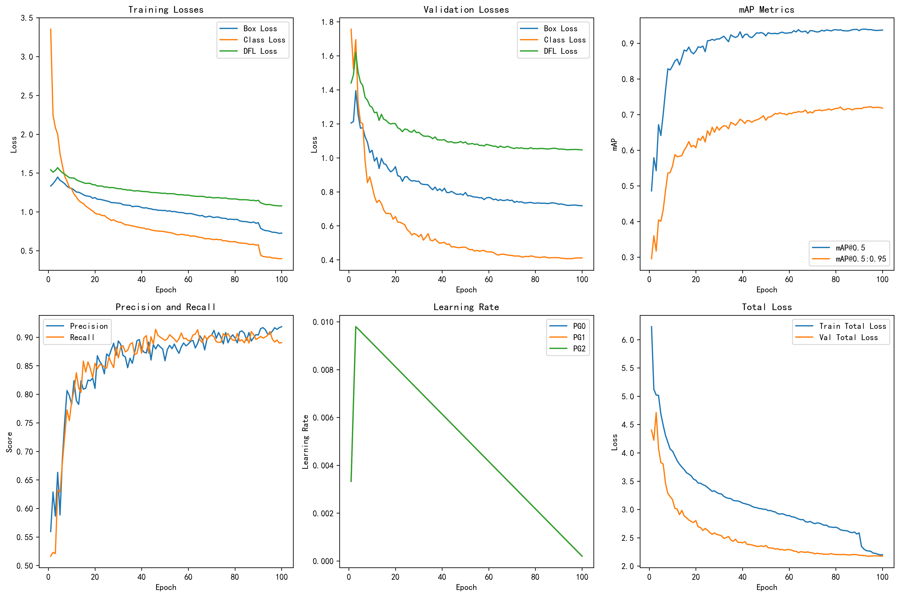
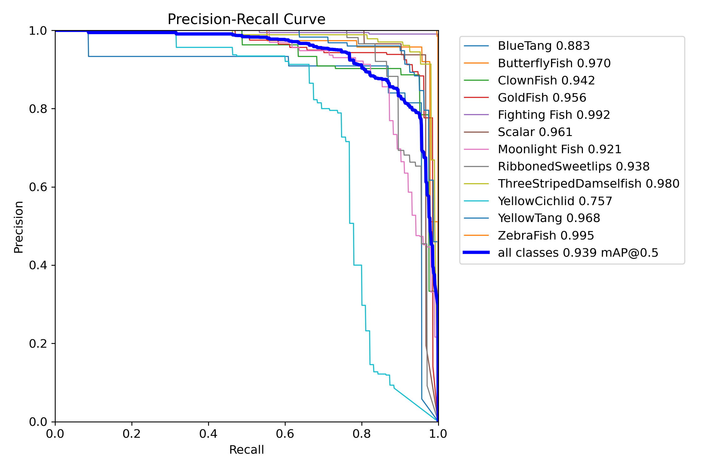
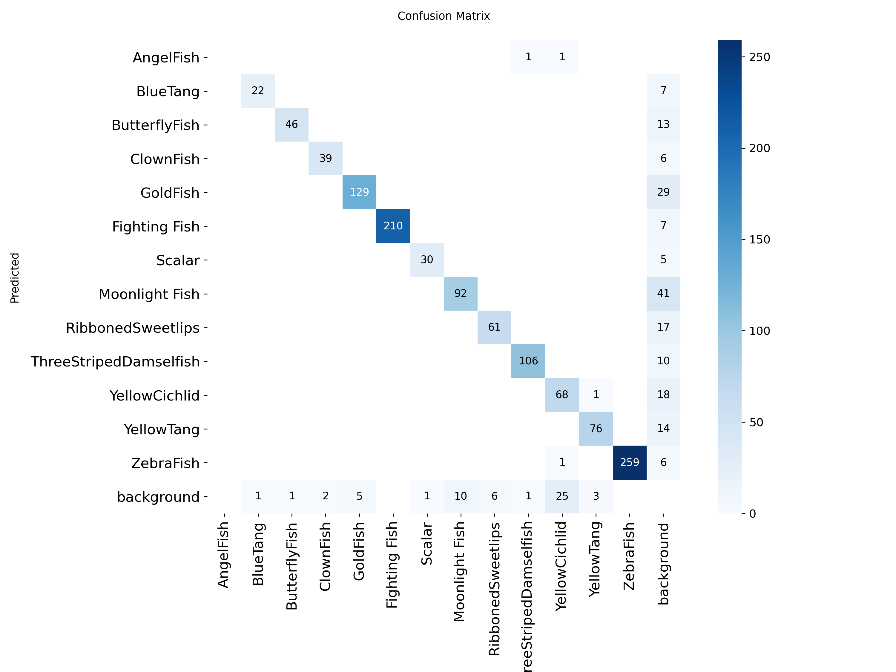

# 鱼类检测模型 (YOLOv8n)

是使用YOLOv8n架构训练的鱼类检测模型，用于检测和识别鱼类目标。[best(v8nfishi1).pt]

## 模型训练参数

| 参数 | 值 |
|------|-----|
| 模型架构 | YOLOv8n |
| 训练轮数 (epochs) | 100 |
| 图像尺寸 (imgsz) | 640 |
| 批次大小 (batch) | 16 |
| 优化器 | auto |
| 初始学习率 (lr0) | 0.01 |
| 最终学习率 (lrf) | 0.01 |
| 动量 (momentum) | 0.937 |
| 权重衰减 (weight_decay) | 0.0005 |
| warmup_epochs | 3.0 |
| 数据增强 | mosaic=1.0, flipud=0.0, fliplr=0.5 |

## 模型性能指标

在验证集上的最终性能指标：

| 指标 | 值 |
|------|----|
| mAP@0.5 | 0.9386165640929695 |
| mAP@0.5:0.95 | 0.7214482157746186 |
| 精确率 (Precision) | 0.9067581484840882 |
| 召回率 (Recall) | 0.9096156441895663 |
| Box Loss | 0.71836 |
| 分类 Loss (cls) | 0.41086 |
| DFL Loss | 1.04685 |

## 训练损失曲线

## PR曲线

## 混淆矩阵

## 训练和验证损失

训练过程中，各项损失指标持续下降，表明模型学习效果良好。

### 训练损失
- Box Loss: 从1.33降至0.72
- 分类Loss: 从3.35降至0.40
- DFL Loss: 从1.54降至1.08

### 验证损失
- Box Loss: 从1.20降至0.72
- 分类Loss: 从1.76降至0.41
- DFL Loss: 从1.44降至1.05

